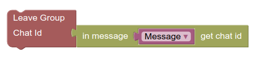
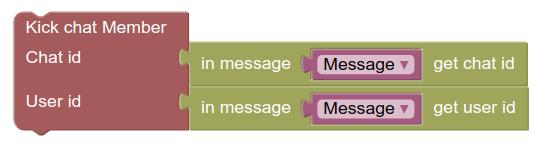
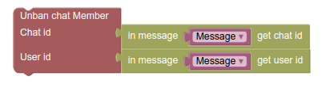
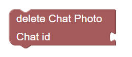
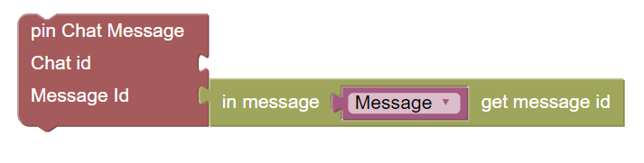
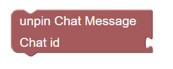

# پازل های Chat Management

### پازل Leave Group

برای خارج شدن از گروه یا کانال از این پازل استفاده می شود. مقابل Chat Id شناسه مربوط به گروه یا کانال مورد نظر را قرار بدهید.

### پازل Kick Chat Memeber

با این پازل اگر بات شما دسترسی لازم را داشته باشد، عضوی را از گروه یا کانال اخراج می کند.

در قسمت اول (Chat id) شناسه گروه یا کانال مورد نظر را قرار داده و در قسمت دوم (User id) شناسه کاربر مورد نظر را قرار می دهیم.

### پازل Get Chat

### پازل Get Chat Administrators

...

### پازل Unban Chat Member

با این پازل می توانید فردی را از حالت ban خارج کنید.

در گروه یا کانال کسی که ban شده است، نمی تواند وارد آن گروه یا کانال شود.

برای اینکار بات شما می بایست دسترسی لازم (administrator) را در گروه یا کانال مورد نظر داشته باشد.

### پازل Delete chat photo

با استفاده از این پازل عکس کانال یا گروه مورد نظر را پاک می کنید. برای اینکار فقط id کانال یا گروه مورد نظر را در این پازل قرار دهید.

### پازل Pin chat message

با این پازل پیام مورد نظر خود را pin می کنید. برای اینکار به id پیام مربوطه و کانال یا گروه مورد نظر احتیاج دارید.

### پازل Unpin chat message

با قرار دادن id کانال یا گروه مورد نظر در این پازل پیام از قبل pin شده در کانال یا گروه را، unpin می کنید.

توجه کنید که در عکس های بالا Message باید از قبل تعریف شده باشد*.
